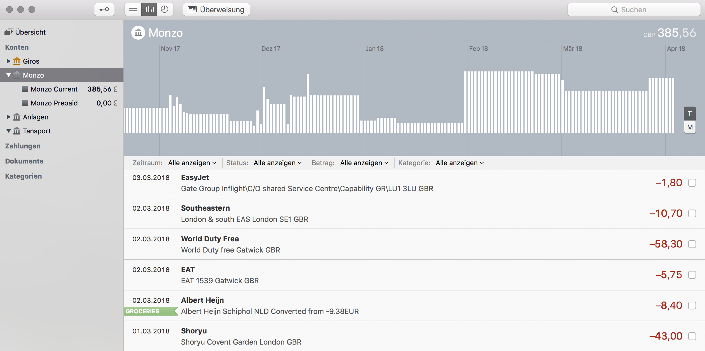

Inofficial extension to fetch transactions from [Monzo](https://monzo.com) for [MoneyMoney.app](http://moneymoney-app.com)

Requirements
----------------

* [Monzo Account](https://monzo.com)
* [MoneyMoney.app](http://moneymoney-app.com) (>= 2.3.5)
* As the Monzo API is still in beta, I need to manually add your Monzo UserID to the Monzo OAuth client application, or you need to create your own client app. See [Add Account] for details.

To Dos
---------
* Support Monzo's pods

Installation
------------

### Signed copy from Extensions Page (preferred)

1. Download a signed version of this from https://moneymoney-app.com/extensions/
  * Open MoneyMoney, tap *Hilfe* > *Zeige Datenbank*
  * put the downloaded `Monzo.lua` file in the shown folder
2. Create a new Monzo app via https://developers.monzo.com/
  * Create a new OAuth client via https://developers.monzo.com/apps/new
  * Make sure to add `moneymoney-app://oauth` in the *Redirect URLs* field
  * Add something to the other fields, e.g. `MyMoneyMoneyExtension` as Name
  * Set *Confidentiality* to *Not Confidential*
  * Tap *Submit*
3. Add an account in MoneyMoney
  * create a new account via *Konto* > *Konto hinzufügen*.
  * Use the API-Client-ID from the Monzo app in step 2) for the API-Client-ID field
  * Use the Client secret from the Monzo app in step 2) for the API-Secret field
4. Refresh the newly created account and login via Monzo's OAuth flow

### Usigned copy from the GitHub-Repository

* Copy the `Monzo.lua` file from src into MoneyMoney's Extension folder
  * Open MoneyMoney.app
	* Tap "Hilfe", "Show Database in Finder"
	* Copy `Monzo.lua` into Extensions Folder
* Disable Signature Check (Needs beta Version!)
  * Open MoneyMoney.app
	* Enable Beta-Updates
	* Install update
	* Go to "Extensions"-tab
	* Allow unsigned extensions

Feedback
---------------------

Feel free to create a Github [Ticket](https://github.com/diederich/moneymoney-monzo/issues/new) for feedback / questions.
