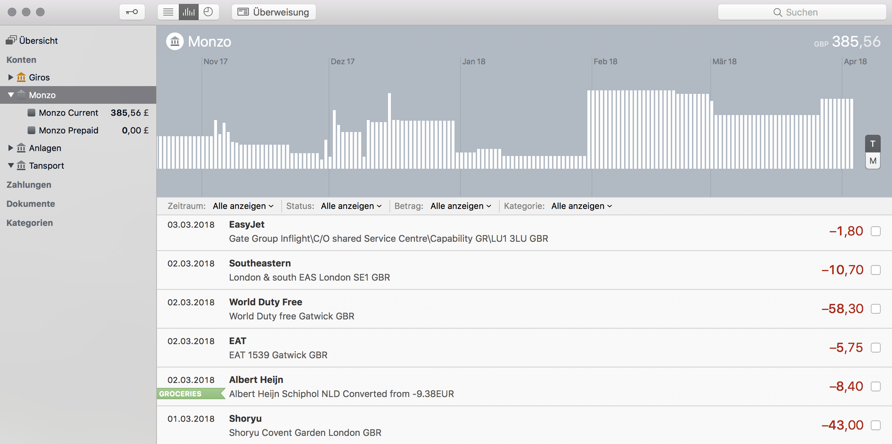

Inofficial extension to fetch transactions from [Monzo](https://monzo.com) for [MoneyMoney.app](http://moneymoney-app.com)



# Requirements

- [Monzo Account](https://monzo.com)
- [MoneyMoney.app](http://moneymoney-app.com) (>= 2.3.5)
- A Monzo OAuth client (see [Installation](#installation))

# Installation

## Install extension

### Either signed copy from Extensions Page (preferred)

- Download a signed version of this from https://moneymoney-app.com/extensions/
  - Open MoneyMoney, tap _Hilfe_ > _Zeige Datenbank_
  - Put the downloaded `Monzo.lua` file in the shown folder

### Or unsigned copy from the GitHub-Repository

- Copy the `Monzo.lua` file from src into MoneyMoney's Extension folder
  - Open MoneyMoney, tap _Hilfe_ > _Zeige Datenbank_
  - Put the downloaded `Monzo.lua` file in the shown folder
- Disable Signature Check (Needs beta Version!)
  - Open MoneyMoney.app
  - Enable Beta-Updates
  - Install update
  - Go to "Extensions"-tab
  - Allow unsigned extensions

### Create OAuth Client

- Create a new Monzo app via https://developers.monzo.com/
  - Create a new OAuth client via https://developers.monzo.com/apps/new
  - Add `https://diederich.github.io/moneymoney-monzo/oauth-redirect/` in the _Redirect URLs_ field (see [OAuth Redirect](#oauth-redirect) below)
  - Add something to the other fields, e.g. `MyMoneyMoneyExtension` as Name
  - Set _Confidentiality_ to _Not Confidential_
  - Tap _Submit_

### Add an account in MoneyMoney

- Create a new account via _Konto_ > _Konto hinzufügen_.
- Use the API-Client-ID from the Monzo app in step 2) for the API-Client-ID field
- Use the Client secret from the Monzo app in step 2) for the API-Secret field

# OAuth Redirect

MoneyMoney uses the custom URL scheme `moneymoney-app://oauth` to receive OAuth callbacks. However, Monzo's login confirmation email filters out non-HTTPS URLs, replacing them with a broken link. To work around this, the extension uses an HTTPS bridge page that immediately forwards the callback back to MoneyMoney.

By default this bridge is hosted as a static GitHub Pages page from this repository at `https://diederich.github.io/moneymoney-monzo/oauth-redirect/`. The page is a single static HTML file ([`docs/oauth-redirect/index.html`](docs/oauth-redirect/index.html)) that forwards the browser to `moneymoney-app://oauth` with the original query string. No data is stored or sent to any third party.

## Self-Hosting

If you prefer to host your own redirect, update the `REDIRECT_URI` variable at the top of `Monzo.lua` and register the matching URL in your Monzo OAuth client at https://developers.monzo.com/.

For a self-hosted static version, use [`docs/oauth-redirect/index.html`](docs/oauth-redirect/index.html) from this repository as a starting point. For a PHP-based redirect:

```php
<?php
header('Location: moneymoney-app://oauth?' . $_SERVER['QUERY_STRING'], true, 302);
exit;
```

Make sure to register the matching redirect URL in your Monzo OAuth client at https://developers.monzo.com/.

# Feedback

Feel free to create a Github Issue for feedback / questions.
